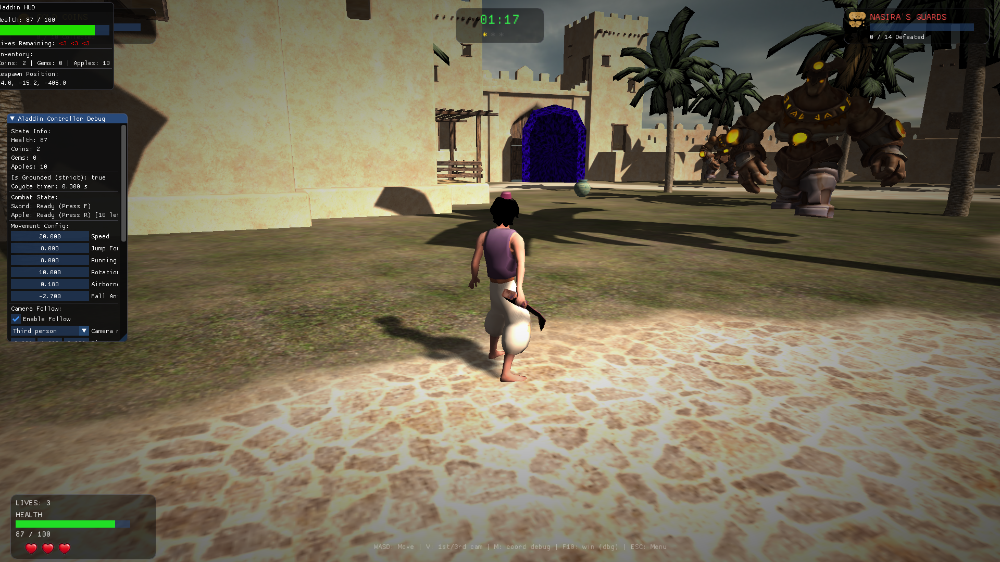
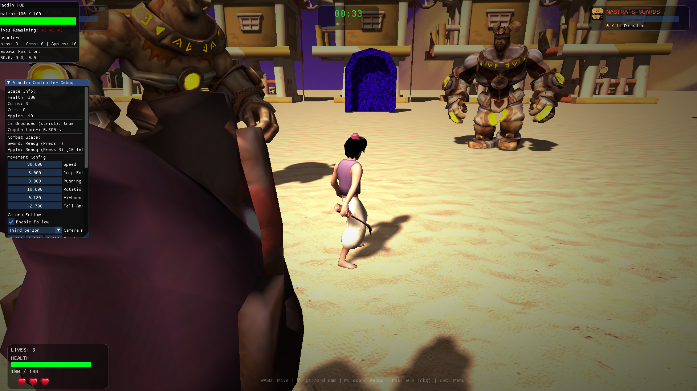
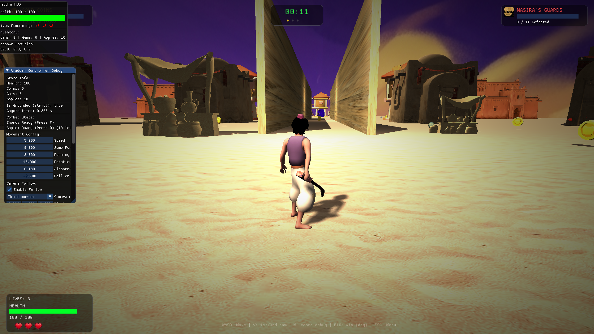
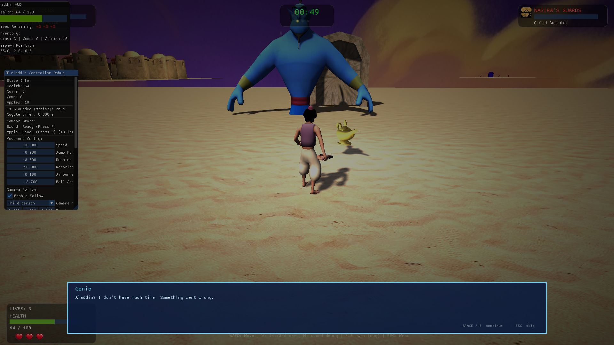
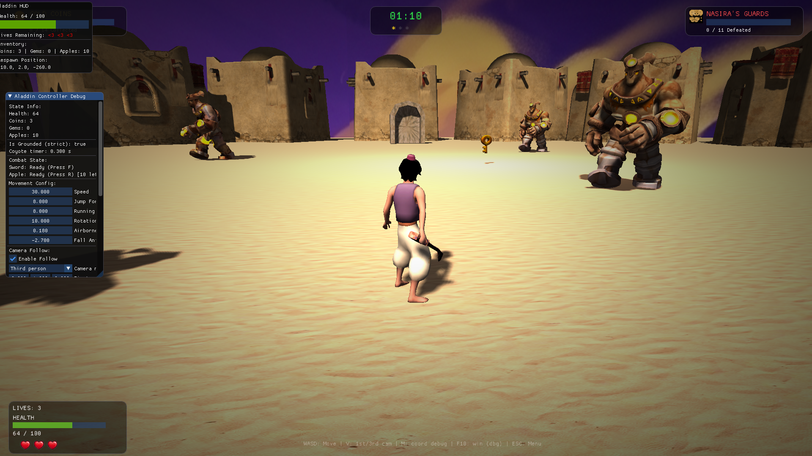
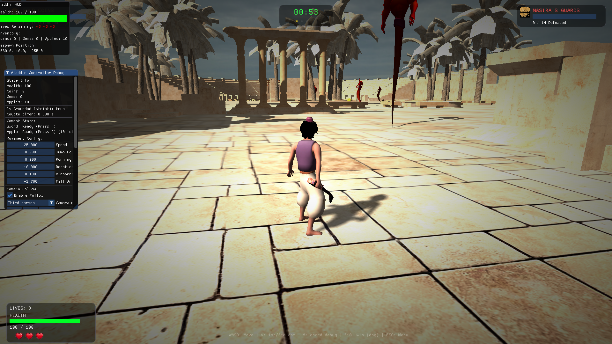
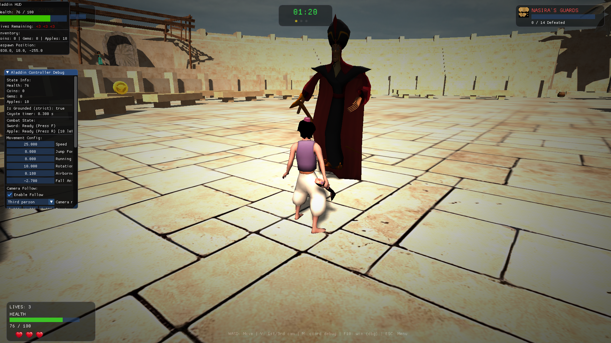

# 🧞 Aladdin: Nasira's Revenge - Engine Documentation

Welcome to the **Aladdin: Nasira's Revenge** project repository. This is a 3D game engine built from scratch using **C++17** and **OpenGL 3.3**, recreating the classic experience of the PS1 era with modern software engineering practices.

## 🚀 Overview

This project is a data-driven game engine designed with an **Entity-Component-System (ECS)** architecture. It features a custom rendering pipeline, skeletal animation system, and physics integration.

### Key Features
- 🎨 **Modern Forward Renderer**: Supports Blinn-Phong lighting, shadow mapping, and post-processing.
- 🦴 **Skeletal Animation**: Robust GPU-side vertex skinning for smooth character movements.
- 🌍 **Data-Driven Design**: Entire levels and entities are defined in JSONC, allowing for rapid iteration.
- 🕹️ **Custom Physics**: Integrated with ReactPhysics3D for realistic collisions and triggers.
- 🛠️ **Developer Tools**: Integrated Dear ImGui for real-time debugging and world inspection.

## 🎬 Demo video

A gameplay and engine overview is available in the repository: [docs/videos/overview.mp4](docs/videos/demo.mp4).

## 🖼️ Gallery

Explore the world of Agrabah and the engine's capabilities:

| | |
| :---: | :---: |
|  |  |
|  |  |
|  |  |
|  | |

## 📂 Project Structure

- `source/`: Core engine and game logic source code.
- `config/`: JSONC configuration files for levels, assets, and engine settings.
- `assets/`: 3D models, textures, shaders, and audio files.
- `docs/`: Comprehensive technical documentation (see below).

## 📖 Documentation

The project's documentation is organized into several sections to help you get started:

- [**Main Documentation Index**](docs/README.md) - The entry point for all engine technical docs.
- [**Physics System Guide**](docs/guides/PHYSICS_SYSTEM_GUIDE.md) - Detailed breakdown of the physics implementation.
- [**Course Instructions**](docs/course/instructions.md) - Original project requirements and phase details.

## 🛠️ Getting Started

### Prerequisites
- **CMake** (3.15+)
- **C++17** Compatible Compiler (Visual Studio 2019+, GCC 9+, or Clang 9+)
- **OpenGL 3.3** Compatible Hardware

### Build Instructions
1. Clone the repository.
2. Run CMake to generate build files:
   ```bash
   cmake -B build
   ```
3. Build the project:
   ```bash
   cmake --build build --config Release
   ```
4. Run the application from the project root:
   ```bash
   ./bin/GAME_APPLICATION.exe
   ```

## 👥 The Team (Team 15)

| Name | GitHub |
| :--- | :--- |
| **Karim Yasser** | [@KarimmYasser](https://github.com/KarimmYasser) |
| **Kerolos Mohsen** | [@kerolos-mohsen](https://github.com/kerolos-mohsen) |
| **Ahmed Kamal** | [@ahmedkamal14](https://github.com/ahmedkamal14) |
| **Mario Raafat** | [@MarioRaafat](https://github.com/MarioRaafat) |

---
*Created for the CMP3060 Computer Graphics Course.*
